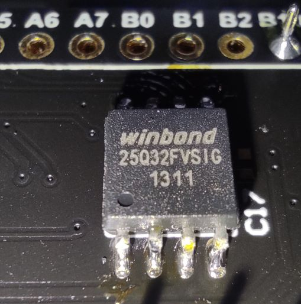

# Winbond W25Q series tiny driver

## BlackPill STM32F411 にSPI Flashをつけてアクセスする

裏面にSPI Flashをはんだ付けする  


STM32CubeIDEで
- SPI1を有効化
- SPIフラッシュのCSに使うA4ピンをGPIO出力にする
- LEDで使用するC13ピンをGPIO出力にする

spi.c, w25_flash.cをCore/Src/に、spi.h, w25_flash.hをCore/Incに追加して、Core/Src/のmain.cを差し替える  
main.cの変更分は
```
  /* USER CODE BEGIN Init */
  uint8_t write_buf[] = { 0x01, 0x02, 0x03, 0x04 };
  uint8_t read_buf[4] = { 0 };
  /* USER CODE END Init */
```
と
```
  /* USER CODE BEGIN WHILE */
  while (1)
  {
    HAL_Delay(500);
    HAL_GPIO_WritePin(GPIOC, GPIO_PIN_13, GPIO_PIN_SET);

    w25_flash_write_enable();
    w25_flash_sector_erase(0);

    /* ensure we get 0xff (erased) */
    uint8_t tb = 0;
    w25_flash_read_data(0, &tb, 1);

    /* now write some data and read it back */
    w25_flash_write_enable();
    w25_flash_page_program(0, write_buf, 4, false);

    w25_flash_read_data(0, read_buf, 4);

    bool success = tb == 0xFF && read_buf[0] == write_buf[0]
                              && read_buf[1] == write_buf[1]
                              && read_buf[2] == write_buf[2]
                              && read_buf[3] == write_buf[3];

    HAL_Delay(500);
    //HAL_GPIO_WritePin(GPIOC, GPIO_PIN_13, GPIO_PIN_RESET);
    if(success){
      HAL_GPIO_WritePin(GPIOC, GPIO_PIN_13, GPIO_PIN_RESET);
    }

    /* USER CODE END WHILE */
```

LEDが点滅するとアクセス成功(のはず)

## オリジナル

[Winbond W25Q series tiny driver](https://github.com/DexterHaslem/winbond-w25-flash-drv)

## この下オリジナルのREAME

This is a basic synchronous driver for the winbond W25 series of serial NOR 
flash devices. ([Datasheets](https://www.winbond.com/hq/support/resources/?__locale=en&line=/product/code-storage-flash-memory/index.html&family=/product/code-storage-flash-memory/serial-nor-flash/index.html&pno=W25Q32JV&category=/.categories/resources/datasheet/) )

It's been tested on a W25Q32JV 

## Usage

The driver is MCU agnostic, implement or replace the following SPI defines in `spi.h`):

- `SPI_EXCHANGE`: spi byte exchange - must be 8 bits wide, eg `uint8_t myfunc(uint8_t sendval)`
- `SPI_FLASH_CS_ENABLE`: of type `void()`: cs enable (drive line low) for this the flash chip slave
- `SPI_FLASH_CS_DISABLE`: of type `void()`: cs disable (drive line high) for this the flash chip slave

All W25Q32JV functions are **synchronous**, designed to be called in a RTOS system 
with tasks that can block/yield/sleep. Read/write ops spin wait on busy status to
 completion for simplicity. 

## Not implemented

Dual and quad IO ops are not implemented in this driver due to targeting 3 pin SPI.
It's not particularly fast, designed for tight / small devices over raw speed (use dual/SQI for that!)

## Misc

This driver was realized on a PIC24F08KL200 and has MPLABX + XC16 test code in main.c
